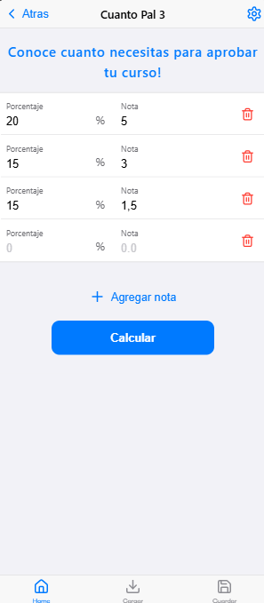

# Cuanto pal 3



> A web/mobile application that allows you to calculate the grade you need to pass a course.

# Requirements
- `vite >= 6.1.1`
- `Node.js >= 22.11.0`
- `npm >= 10.9.0`
- `sass >= 1.85.0`
- `react >= 19.0.0`
- `lucide-react >= 0.475.0`

# Wireframe
[Figma wireframe](https://www.figma.com/design/DCOEKOjael3tFWLQQzgqd7/Untitled?node-id=0-1&p=f&t=DkIWzpQ9KEjyD6b7-0)

# Prototype
[Adobe XD prototype](https://xd.adobe.com/view/93401274-7dd9-4206-91bf-7a6168d5d6ee-c613/screen/b1c4822b-be1e-4550-a486-861124afac73/)

# Installation
1. Clone the repository
```bash
git clone https://github.com/02loveslollipop/CuantoPal3.git
```

2. Get into the react folder
```bash
cd react
```

3. Install the dependencies
```bash
npm install
```

4. Run the application as a development server
```bash
npm run dev
```

